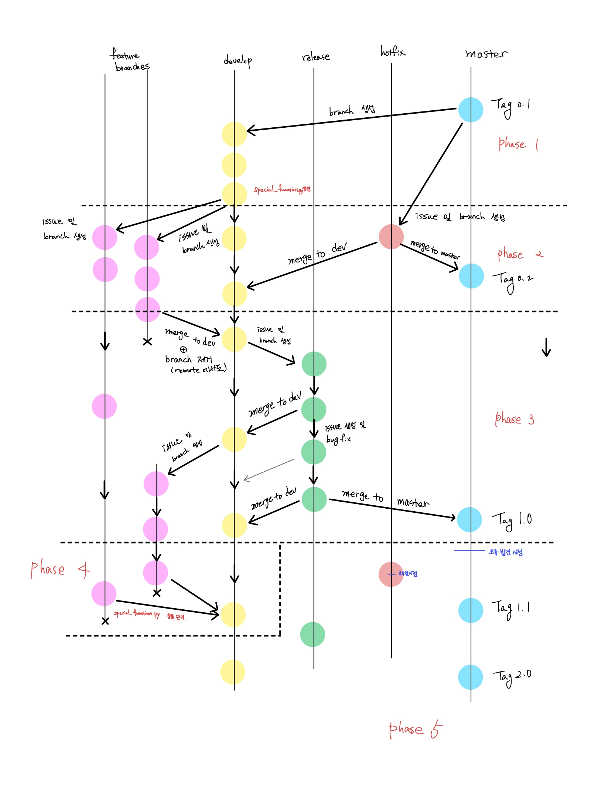
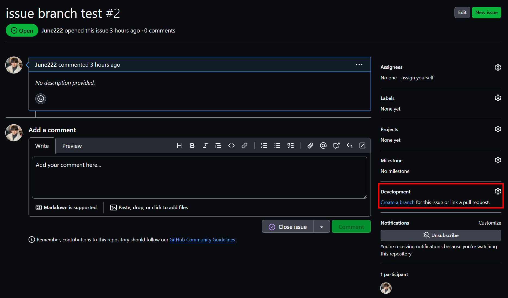
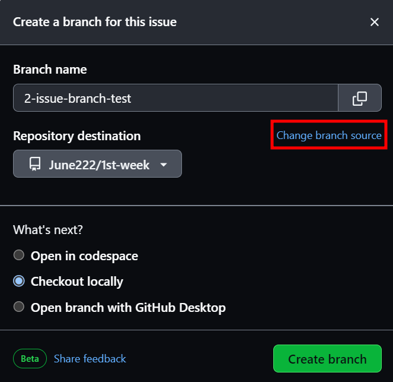
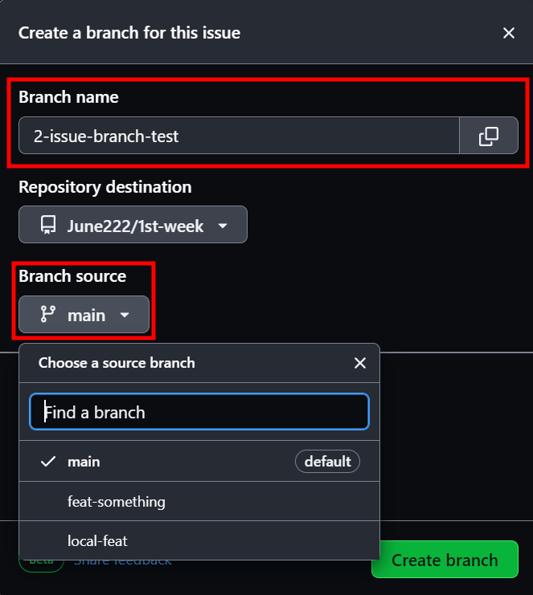
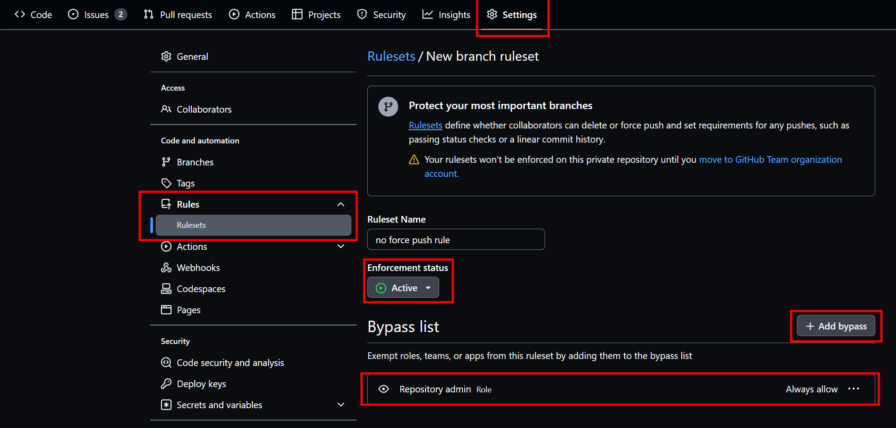
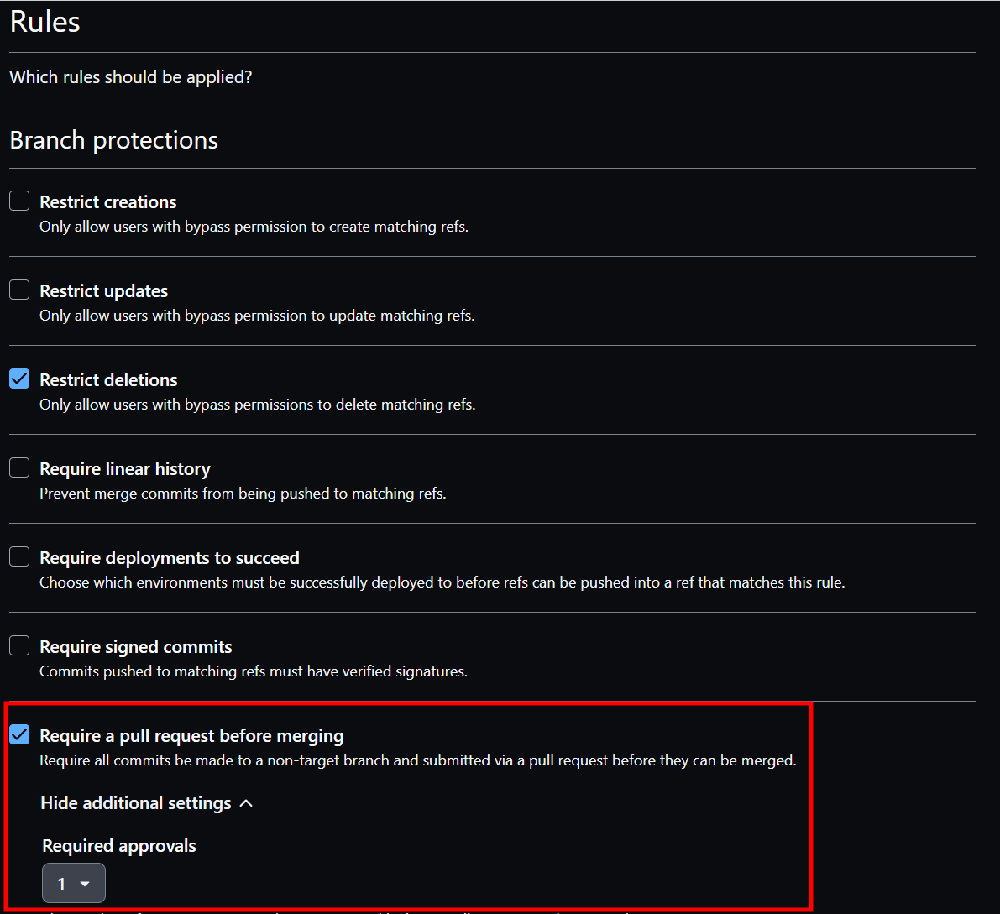

# Ref.

[issue에서 브랜치 생성](#cf-issue에서-branch-생성하기)  
[ruleset 만들기](#cf-ruleset-만들기)  

# 팀장 TODO

1. 커밋을 위한 파일 생성은 `work_dir`에서 진행해주세요.
2. tag는 [여기](https://github.com/June222/Last-AID-git-study/blob/main/sources/description_of_tag.md)를 참고해주세요.
3. 아래 그림을 참고하여 각 phase에서 적절히 `issue`와 `branch`를 생성해주세요
4. 팀원의 수준을 고려하여 branch별 할 일을 알려주세요.
5. 팀원이 `pull request`를 날리면 `review`하며 [커밋 규칙](https://github.com/June222/last-AID-git-study/blob/main/sources/requirement_of_commit.md)을 지켰는지 확인해주세요.
6. 각 phase가 끝나면 스터디 장에게 보고한 후 다음 phase로 넘어가주세요.

# Phase 5
- 비워진 phase 5를 이미 진행한 workflow와 tag를 참고하여 채워보세요.
- 팀원들과도 회의해보세요.
- 결정나면 스터디 장에게 알려준 뒤 진행해주세요.

### cf. issue에서 branch 생성하기.
1. remote repository를 local에서 push를 완료한 뒤 최신 상태로 변경
2. issue 생성 후 오른쪽 아래 `create a branch` 클릭
3. `change branch source` 클릭
4. `branch name` 변경 
5. `branch source` 클릭 후 원하는 branch 설정  
 

### cf. ruleset 만들기
1. 내 repo의 `setting` 클릭
2. `Rules` 클릭
3. `Enforcement status` 를 `Active`로 바꾸기
4. `+Add bypass`에서 `Repository Admin` 추가
5. `Target branches`에 `dev`,`main`,`release`,`master` 추가 (\"없이 추가)
6. `Require a pull request before merging` 체크
7. `Require Approvals` 1로 변경

