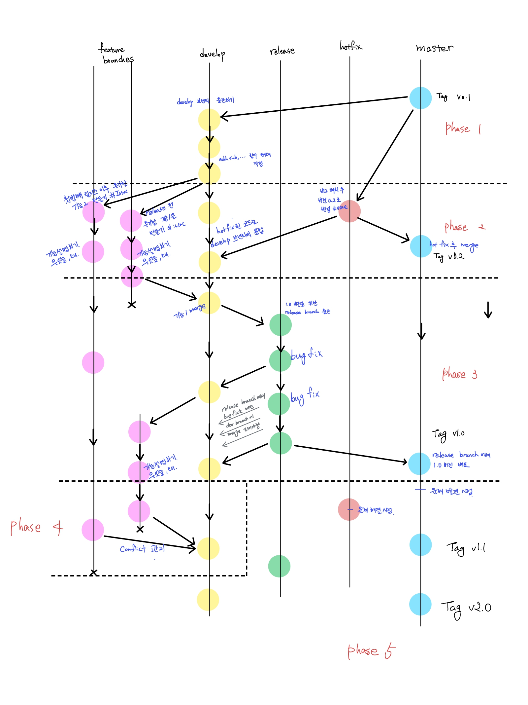

# 팀원 TODO

1. 커밋을 위한 파일 생성은 `work_dir`에서 진행해주세요.
2. 아래 그림의 내용을 commit에 담되 [커밋 규칙](https://github.com/June222/last-AID-git-study/blob/main/sources/requirement_of_commit.md)을 지켜서 commit 해주세요.
3. `pull request` 이후 팀장이 `review`를 마치면 `merge`를 진행해주세요.
4. 파란색 글씨 이외의 commit은 규칙만 지켜서 작성해주세요.
5. **팀원은 각 phase가 끝나면 아래 명령어를 항상 실행한다.**

```bash
# Phase가 끝나면 실행할 명령어
git fetch origin # 팀장이 remote repo에 변경한 사항을 local로 불러오기

# 변경사항이 있다면
git checkout {branch_name} # update할 branch로 변경 **중요**
git pull origin {branch_name}
``` 

<br><br>


